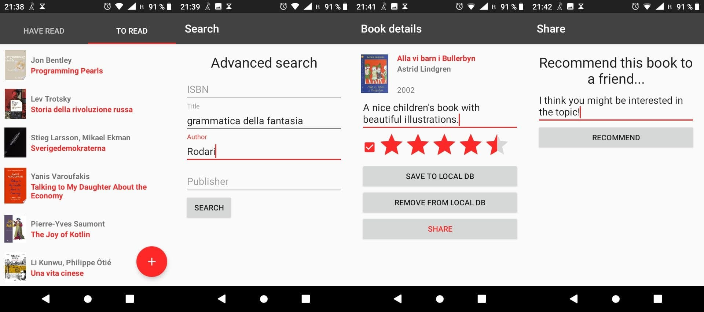

<h1 align=left>

</h1>

A free Kotlin android app to manage books.
This is my final project for _two_ (eheh... efficiency!) of my Bachelor's degree courses (_Programmazione 3_ and _Sistemi aperti e distribuiti_).

It is now available on F-Droid, something I'm very happy about as I feel that Android is a pretty nice OS, but it seriously needs some more free software.

## What you can do with Librery:

- Advanced search in Google books (Google account not required)
- Save book data locally
- Add notes and rating to each book in your library
- Share your thoughts about books you're reading with other users (in a very basic way)
- Enjoy the beautiful Librery logo kindly designed by [Zularizal](https://github.com/zularizal) ;)
- Use the app in English, Italian, Spanish (thanks [sguinetti](https://github.com/sguinetti)!) and (if you're not too picky) Swedish
- Run, study, share and redistribute the code... cause it's free software!

## Documentation
This project is somewhat documented, but at the moment the documentation is not exhaustive and in Italian, as it was written in order to pass the _Sistemi aperti e distribuiti_ course in my local uni and just focuses on the networking aspects. Still, in case you are curious, you can download the pdfs available with release 2.0 or compile the LaTeX files in LibreryDocs yourself.
